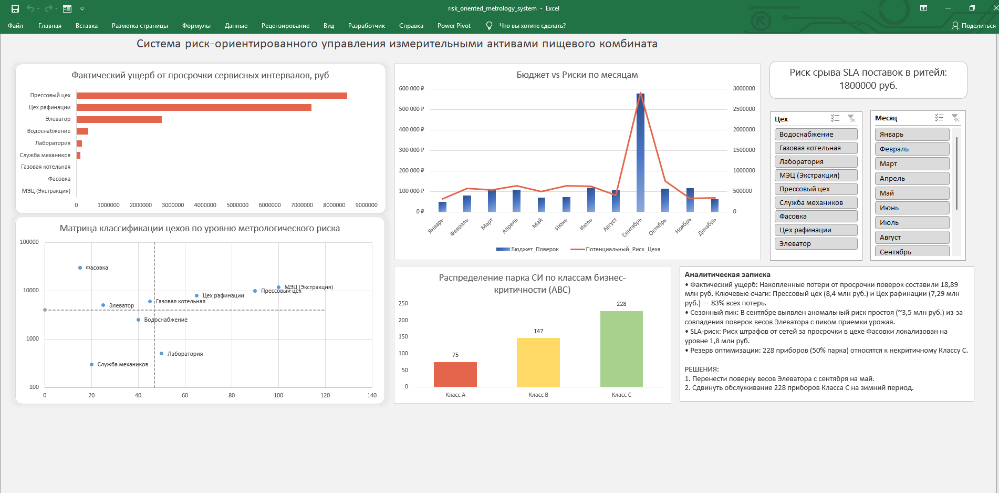
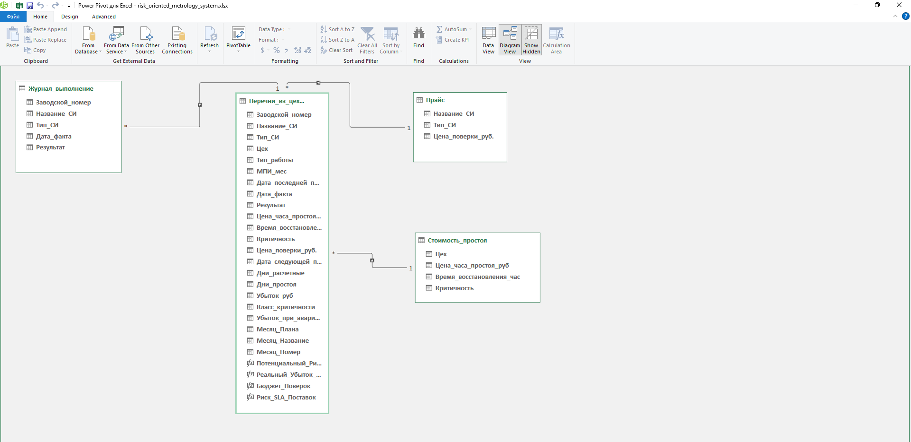

# Система риск-ориентированного управления измерительными активами пищевого комбината

## 🎯 Описание проекта
Бизнес-инструмент для трансформации классической метрологической службы из реактивного сервисного подразделения в центр управления операционными рисками и OpEx-бюджетом предприятия.

**Проблема:** Традиционное календарное планирование поверок средств измерений (СИ) не учитывает финансовые потери от простоя оборудования при снятии приборов и риски нарушения контрактов с ритейлом из-за регуляторных просрочек.  
**Решение:** Разработана ETL-модель и интерактивный дашборд, связывающий техническое состояние парка СИ, графики обслуживания и финансовые метрики цехов (стоимость часа простоя, штрафы по SLA).

---

## 📊 Дашборд и Модель данных

### Интерфейс дашборда

### Схема данных в Power Pivot (Схема «Звезда»)

---

## 🛠 Технологический стек
* **Движок данных:** MS Excel, Power Query (ETL, динамический `FolderPath`, очистка и объединение реестров).
* **Моделирование:** Power Pivot (реляционная модель данных по схеме «Звезда»).
* **Вычисления (DAX):** 
  * `Бюджет_Поверок` - суммарный плановый бюджет на обслуживание.
  * `Потенциальный_Риск_Цеха` - оценка финансовых угроз в случае аварийной остановки.
  * `Реальный_Убыток_Просрочки` - фактический накопленный ущерб от нарушения межповерочных интервалов.
  * `Риск_SLA_Поставок` - расчет коммерческого риска по цеху Фасовки через `CALCULATE`.
* **Визуализация:** Интерактивный UI с риск-ориентированным распределением зон контроля и категорийным ABC-анализом критичности приборов.

---

## 📈 Ключевые аналитические инсайты и выводы

* **Фактический ущерб:** Обнаружен накопленный ущерб от скрытых просрочек поверок в размере **18,89 млн руб.** Основные точки потерь: Прессовый цех (**8,4 млн руб.**) и Цех рафинации (**7,29 млн руб.**).
* **Сезонная уязвимость:** Выявлен аномальный пик технологического риска в **сентябре**. Он обусловлен наложением планового обслуживания весового хозяйства Элеватора на пик заготовительного сезона сырья.
* **Коммерческий риск (SLA):** Потенциальные штрафные санкции со стороны торговых сетей из-за регуляторных рисков на линиях финишной упаковки (цех Фасовки) оценены в **1 800 000 руб.**
* **Резерв оптимизации:** ABC-анализ показал, что **228 приборов** (50% парка) относятся к некритичному Классу С. Это позволяет использовать их как гибкий буфер для выравнивания графиков нагрузки.

---

## 💡 Предложенные управленческие решения
1. **Сдвиг графиков Элеватора:** Перенос обслуживания ключевых ЖД и автовесов с сентября на май (межсезонье), что нивелирует риск остановки приемки сырья.
2. **Управление пиками через Класс С:** Перераспределение плановых поверок приборов Класса С (Лаборатория, Механики) на зимний период для разгрузки бюджета и штата в пиковые месяцы.
3. **Оборотный фонд (ЗИП):** Обоснование выделения OpEx-бюджета на закупку подменного фонда датчиков и расходомеров для исключения технологического простоя высококритичных линий во время поверки в ЦСМ.

---

## 📂 Как развернуть проект локально

1. Клонируйте репозиторий или скачайте архив с проектом на свой ПК.
2. Откройте файл `dashboard/risk_oriented_metrology_system.xlsx` в MS Excel.
3. На листе параметров (или в именованной ячейке `FolderPath`) укажите локальный путь к вашей папке `data/` на компьютере.
4. Перейдите на вкладку **Данные** и нажмите **Обновить всё** для перезапуска ETL-цепочки Power Query.
5. Исходный код DAX-мер можно изучить в папке `dax/`.

---

## 🛠 История разработки и коммиты (Git Log)

1. `init: инициализация структуры проекта и обезличенных наборов данных`
2. `feat(etl): настройка ETL-запросов Power Query с динамическим параметром FolderPath`
3. `feat(data-model): построение реляционной модели данных «Звезда» в Power Pivot`
4. `feat(dax): реализация DAX-мер для расчета риска SLA, ущерба от простоев и бюджета`
5. `feat(dashboard): разработка интерактивного дашборда из 6 графиков с кросс-фильтрацией`
6. `docs: добавление аналитической записки и формирование документации в README`
